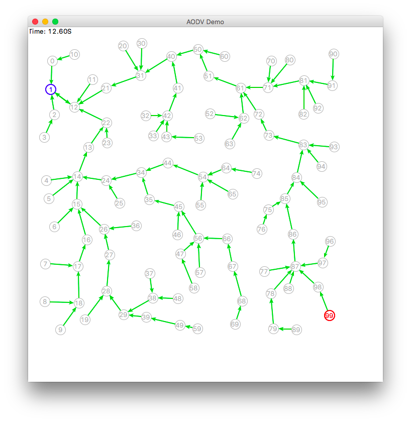

SimPy-based WSN Simulator 
=========================

WsnSimPy is a simulator for wireless sensor networks, modeling both
network-level messaging and full-stack communications.  It is written in Python
3 and built on top of the [SimPy](https://simpy.readthedocs.io/en/latest/)
simulation framework.

Installation
------------

    pip install wsnsimpy
    
Running Examples
----------------

Examples can be found in the directory `wsnsimpy/examples`, which can be started
directly from a command line.

    python -m wsnsimpy.examples.flood

    python -m wsnsimpy.examples.aodv

